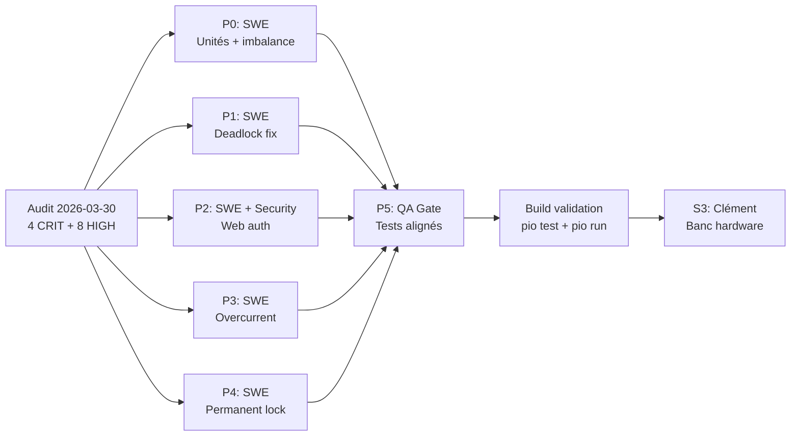

# Assignation Agents et Tâches

Date: 2026-03-30
Statut: active (post-audit)

## Matrice opérationnelle

| Axe | Agent principal | Sous-agent/Support | Sortie attendue | KPI |
|---|---|---|---|---|
| Sécurité firmware | BMU Safety Review | SE: Security | Findings classés + recommandations | 0 régression critique |
| Gate QA/CI | QA Gate | SE: DevOps/CI | Verdict PASS/FAIL + preuves runs | preuves distantes archivées |
| Cartographie contexte | Explore | Context Architect | Context map + dépendances | couverture fichiers critiques |
| Implémentation code | SWE | gem-implementer | Patchs vérifiés + tests | tests verts + build stable |
| Documentation | SE: Tech Writer | Explore | README/plans/specs synchronisés | 0 contradiction statut |
| ML/Cloud orchestration | SWE | QA Gate | Pipeline conteneur exécuté + artefacts | run-container success |
| Audit CRIT fixes | SWE | BMU Safety Review | Patchs CRIT-A..D + tests | sim-host PASS + S3 build |

## Assignation par lot — Phase 4 (Audit Fixes)

| Lot | Priorité | Owner | Support | Entrée | Sortie |
|---|---|---|---|---|---|
| P0-UNIT-FIX | P0 | SWE | BMU Safety Review | CRIT-A + CRIT-B findings | BatteryParallelator.cpp + main.cpp patchés |
| P1-DEADLOCK-FIX | P1 | SWE | — | CRIT-C finding | BatteryRouteValidation.cpp patché |
| P2-WEB-AUTH | P2 | SWE | SE: Security | CRIT-D finding | Routes POST + token JS + #warning |
| P3-OVERCURRENT | P3 | SWE | — | HIGH-1 finding | fabs() dans ERROR handler |
| P4-LOCK-IMPL | P4 | SWE | — | MED-1 finding | Permanent lock implémenté |
| P5-TESTS-ALIGN | P5 | QA Gate | SWE | Tests stub vs code réel | Tests alignés config.h (10A) |
| P6-HARDWARE-BENCH | P6 | Clément (manuel) | — | BMU v1/v2 + PSUs + charges | TB01-TB13 résultats |

## Assignation continue (P1)

| Lot | Owner | Support | Entrée | Sortie |
|---|---|---|---|---|
| P1-README-SYNC | SE: Tech Writer | QA Gate | plans + evidence récents | README cohérent |
| P1-SCHEMA-CONTRACT | ML Team | SWE | telemetry/inference payloads | JSON schema versionnés |
| P1-CI-REMOTE-PROOF | QA Gate | SE: DevOps/CI | workflow sur branche défaut | URL runs + statut |
| P1-PDF-LIBRARY | SE: Tech Writer | — | 12 papers classés | HIGH/MEDIUM/LOW organisés |

## Diagramme de responsabilités Phase 4

## Règles de fonctionnement

1. Une tâche `completed` doit contenir une évidence vérifiable (commande, artefact, URL run).
2. Une tâche `blocked` doit déclarer un unique `Next Action` exécutable immédiatement.
3. Les sorties IA restent consultatives; la sûreté batterie reste locale firmware.
4. Les changements sur plans/docs doivent être synchronisés dans la même itération.
5. **Nouveau:** Aucun fix CRIT ne peut être marqué DONE sans test sim-host vert.

## Escalade

- P0: BMU Safety Review + QA Gate immédiat.
- P1: Team owner + support associé.
- P2: consolidation hebdomadaire par Tech Writer.
- **P6 (hardware bench): intervention Clément requise** — seul lot nécessitant intervention humaine.
