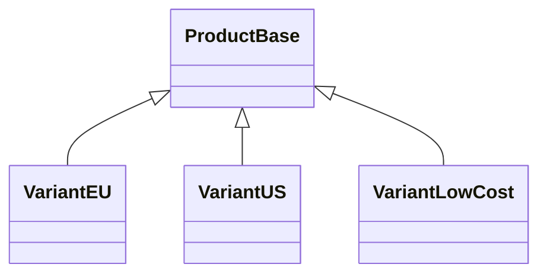
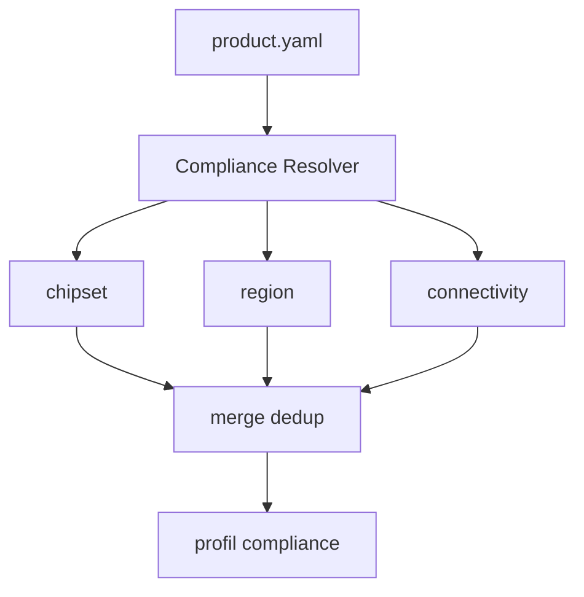

# Assignation Agents et Taches

## Matrice
| Axe | Agent | Support | Sortie attendue |
|---|---|---|---|
| Audit surete | BMU Safety Review | SE: Security | Findings classes |
| Gate QA | QA Gate | SE: DevOps/CI | Verdict + preuves |
| Cartographie | Explore | Context Architect | Context map |
| Correctifs | SWE | gem-implementer | Patches verifies |
| Documentation | SE: Tech Writer | Explore | plan| Documentation | SE: Tech Writer | Explore | plan| Documentation | SE: Tech Writer | Explore | plan| Documentation | SE: Tech Writer | Explore | plan| Documentation | SE: Tech Writer | Explore | plan| Documentation | SE: Tech Writer | Explore | plan| Documentation | SE: Tech Writer | Explore | plan| Documentation | SE: Tech Writer | Explore | plan| Documentation | SE: Tech Writer | Explore | plan| Documentation | SE: Tech Writer | Explore | plan| Documentation | SE: Tech Writer | Explore | plan| Documentation | SE: Tech Writer | Explore | plan| Documentation | SE:-|---|
| G0 | Faisabilite | product.yaml, etude chipset | budget OK, composants dispo, standards identifies | rapport faisabilite |
| G1 | Design Complete | schema + PCB + SPICE | ERC 0, DRC 0, SI/EMC precheck pass, BOM coutee, review IA | schema PDF, PCB 3D, BOM |
| G2 | Proto Valide | proto fonctionnel | tests firmware pass, mesures conformes, courant veille OK | evidence pack proto |
| G3 | Certification | rapports labo | EMC pass, securite pass, RED/CE complet | dossier technique |
| G4 | Production Ready | BOM finale, Gerbers valides | DFM pass, yield >95%, supply chain securisee | manufacturing package |

## Heritage de variantes

## Resolution automatique standards

