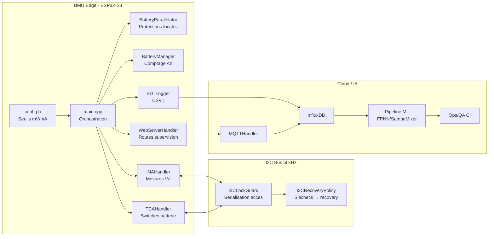
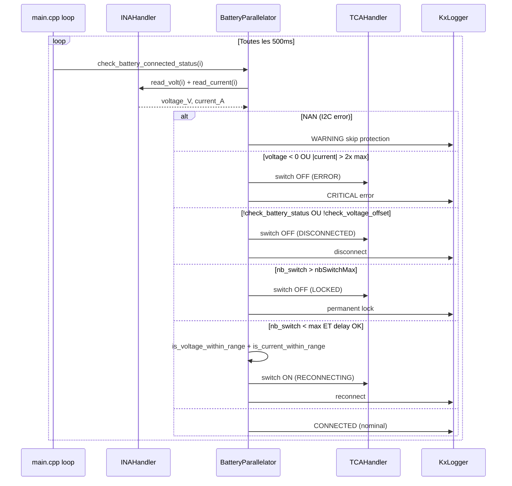
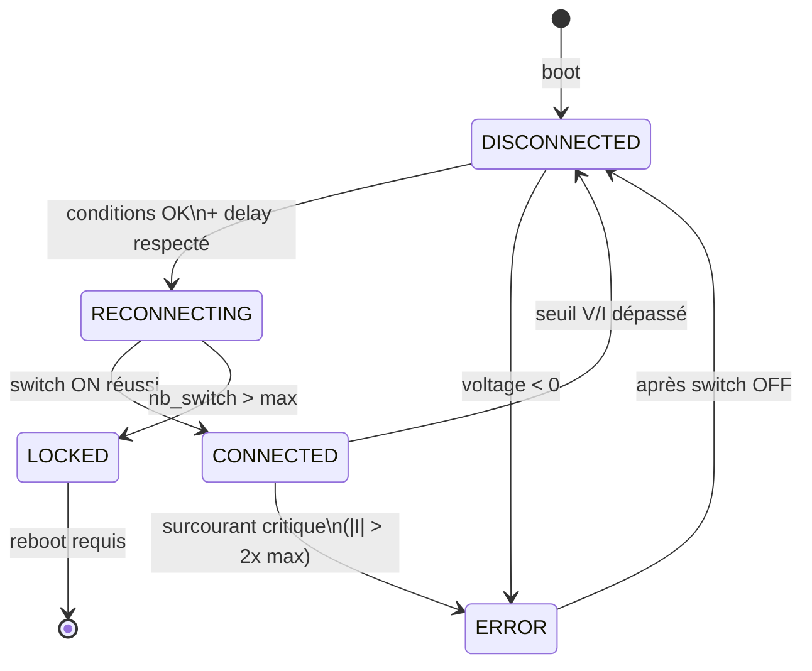
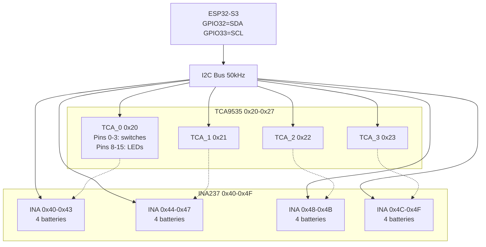
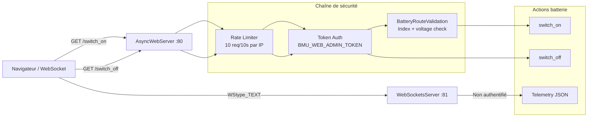
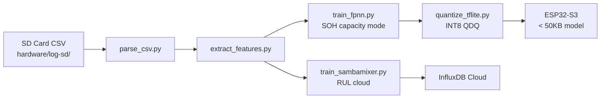

# Architecture Diagrams BMU

Date: 2026-03-30
Statut: active (post-audit)

## 1. Vue bloc BMU (firmware/hardware/cloud)

## 2. Séquence de protection batterie (loop 500ms)

## 3. State machine batterie

## 4. Architecture I2C et topologie

**Contrainte topologie:** `Nb_TCA * 4 == Nb_INA` — sinon fail-safe (toutes batteries OFF).

## 5. Architecture web et sécurité

**Audit CRIT-D:** Routes GET doivent migrer vers POST. WebSocket :81 non authentifié. Token par défaut vide.

## 6. Pipeline ML (optionnel V2)

## 7. Rappels de sûreté

- Les protections critiques restent locales sur MCU — ML reste consultatif.
- Toute opération INA/TCA passe via I2CLockGuard (jamais de double-lock).
- `stateMutex` protège les tableaux partagés (battery_voltages, Nb_switch, reconnect_time).
- Le fail-safe topologie force OFF si `Nb_TCA * 4 != Nb_INA`.
