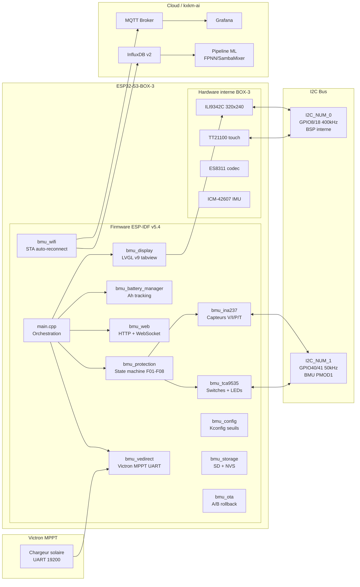
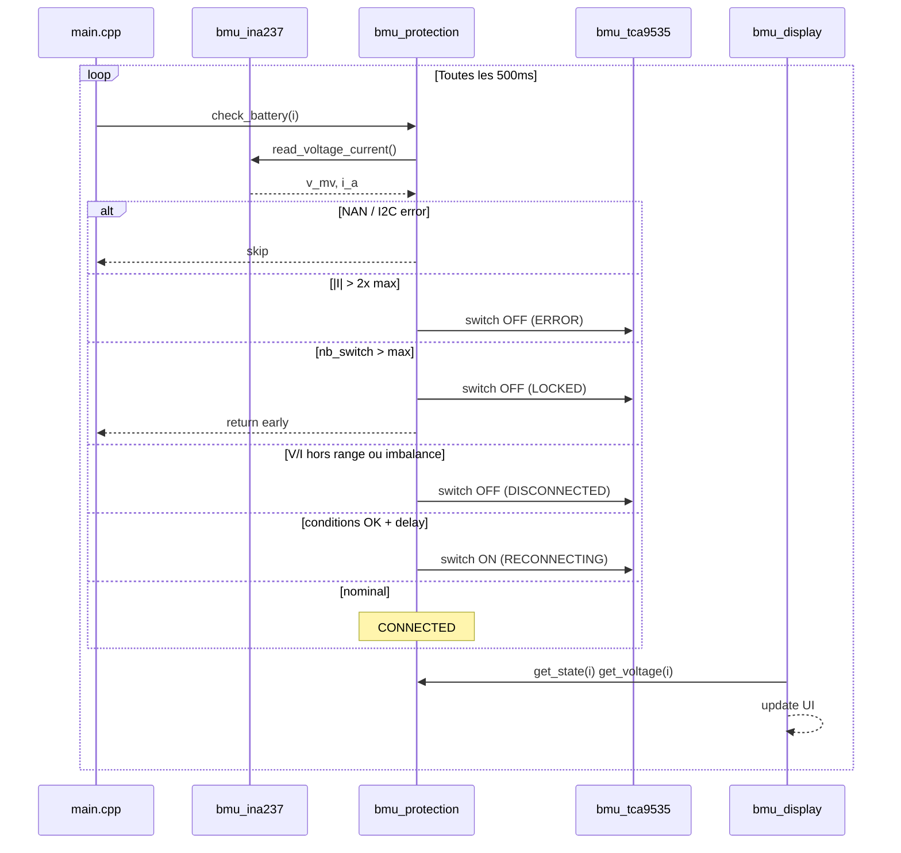
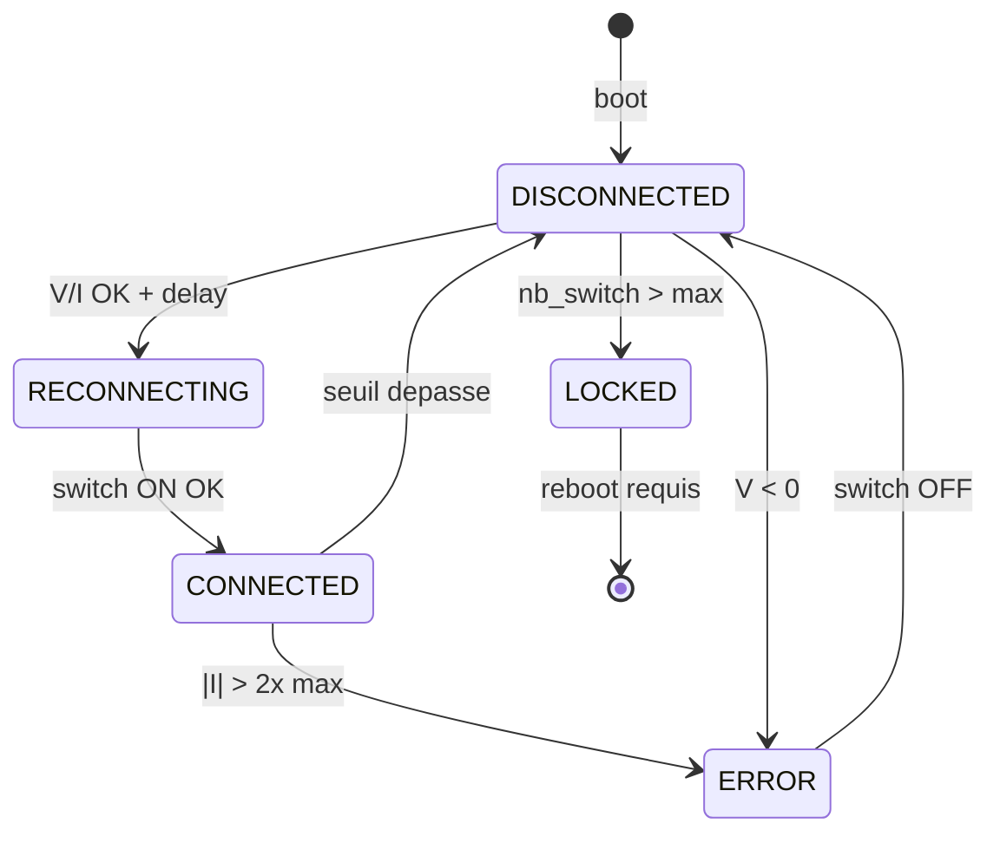
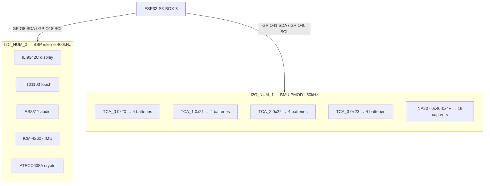
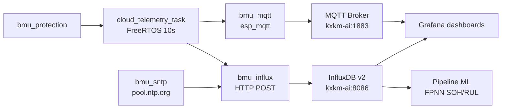
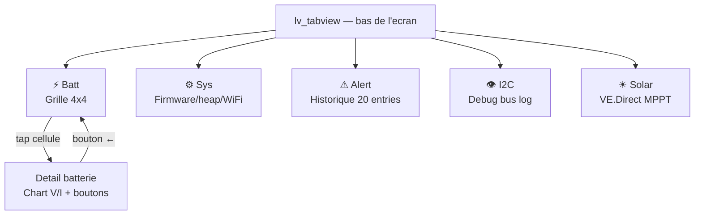
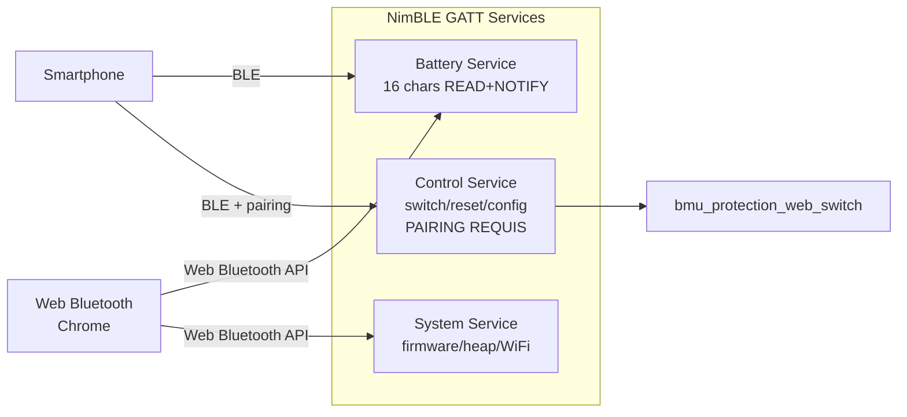

# Architecture Diagrams BMU

Date: 2026-03-31
Statut: active (post-migration ESP-IDF v5.4)

## 1. Vue bloc complete (firmware ESP-IDF / hardware / cloud)



## 2. Sequence protection batterie (boucle 500ms)



## 3. State machine batterie (5 etats)



## 4. Architecture I2C double bus BOX-3



## 5. Architecture web + securite

```mermaid
flowchart LR
  CLIENT[Navigateur]
  WS_C[WebSocket /ws]
  HTTP[esp_http_server :80]

  subgraph AUTH[Chaine securite]
    RL[Rate Limiter\n16 slots LRU]
    TK[Token Auth\nconstant-time]
    VAL[Validation\nbounds + voltage]
  end

  subgraph ACT[Actions]
    PROT_SW[bmu_protection_web_switch]
    API[/api/batteries JSON]
    SPIFFS[SPIFFS index.html]
  end

  CLIENT -->|POST /api/battery/switch_*| HTTP
  HTTP --> RL --> TK --> VAL --> PROT_SW
  CLIENT -->|GET /api/batteries| HTTP --> API
  CLIENT -->|GET /| HTTP --> SPIFFS
  WS_C -->|token first msg| HTTP
```

## 6. Pipeline cloud telemetrie



## 7. Display LVGL tabview (5 onglets planifies)



## 8. Architecture BLE planifiee (Phase 9)



## 9. Rappels de surete

- Protections critiques restent locales sur MCU — ML reste consultatif
- Toute operation I2C multi-registre : `bmu_i2c_lock()`/`bmu_i2c_unlock()`
- `stateMutex` protege les tableaux partages
- Fail-safe topologie force OFF si `Nb_TCA * 4 != Nb_INA`
- Web + BLE mutations passent par `bmu_protection_web_switch()` — jamais direct TCA
- OTA avec rollback : `bmu_ota_mark_valid()` appele au boot
