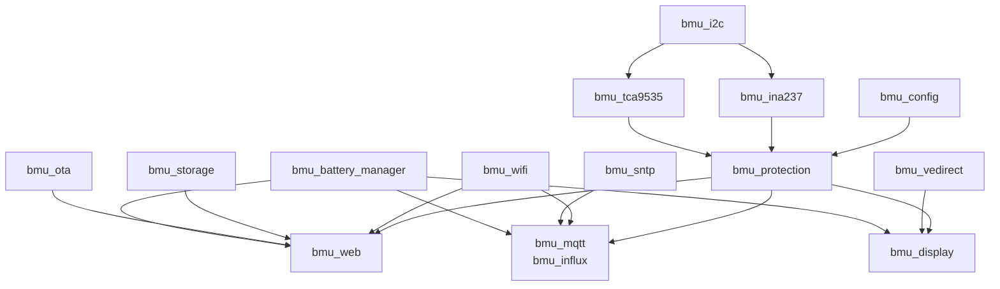

# Feature Map BMU

Date: 2026-03-31
Statut: post-migration ESP-IDF v5.4

## Inventaire F01-F11 + extensions

| Feature | Priorite | Module ESP-IDF | Status |
|---|---|---|---|
| F01 Mesure tension | MUST | bmu_ina237 | Done (datasheet TI) |
| F02 Mesure courant | MUST | bmu_ina237 | Done |
| F03 Coupure sur surtension | MUST | bmu_protection | Done (30000mV) |
| F04 Coupure sur sous-tension | MUST | bmu_protection | Done (24000mV) |
| F05 Coupure sur sur-courant | MUST | bmu_protection | Done (10A, fabs) |
| F06 Coupure sur desequilibre | MUST | bmu_protection | Done (fleet max) |
| F07 Reconnexion automatique | MUST | bmu_protection | Done (delay 10s) |
| F08 Verrouillage permanent | MUST | bmu_protection | Done (>5 coupures) |
| F09 Observabilite logs | SHOULD | ESP_LOGx + SD | Done |
| F10 Supervision web | COULD | bmu_web | Done (POST auth) |
| F11 Support 16 batteries | MUST | bmu_i2c scan | Done |
| F12 Dashboard ecran | NEW | bmu_display | Done (4 tabs LVGL) |
| F13 Cloud telemetrie | NEW | bmu_mqtt + bmu_influx | Done |
| F14 OTA securisee | NEW | bmu_ota | Done (A/B rollback) |
| F15 VE.Direct Victron | NEW | bmu_vedirect | Done (parser UART) |
| F16 Graphique V/I ecran | NEW | bmu_ui_detail | Phase 8 planifie |
| F17 Onglet Solar ecran | NEW | bmu_ui_solar | Phase 8 planifie |
| F18 Bluetooth BLE | NEW | bmu_ble | Phase 9 planifie |

## Couverture tests

| Feature | Host Unity | Rust cargo test | Hardware |
|---|---|---|---|
| F03-F08 | 13 tests (Arduino) | 10 tests (Rust) | BOX-3 boot OK |
| F10 | rate limit + auth tests | — | — |
| F12-F15 | — | — | BOX-3 boot OK |

## Architecture composants ESP-IDF

## Roadmap

| Phase | Contenu | Status |
|-------|---------|--------|
| 0-1 | Scaffold + I2C drivers | Done |
| 2 | Protection + Battery Manager | Done |
| 3 | WiFi + Web + Storage | Done |
| 4 | MQTT + InfluxDB + SNTP | Done |
| 5 | Tests CI + OTA | Done |
| 6 | Display LVGL tabview | Done |
| 7 | VE.Direct Victron | Done |
| 8 | Display enhanced (chart, detail tap, solar tab) | Planifie |
| 9 | Bluetooth BLE (NimBLE, GATT, Web Bluetooth) | Planifie |
| 10 | TinyML edge SOH (futur) | Spec existante |
