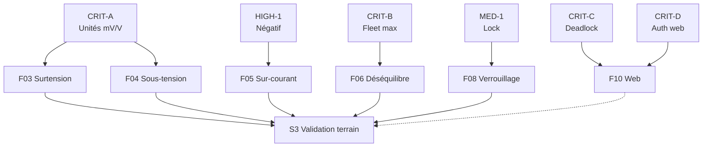

# Feature Map BMU

Date: 2026-03-30
Statut: post-audit

## Inventaire F01-F11

| Feature | Priorité | Module | Test principal | Statut audit |
|---|---|---|---|---|
| F01 Mesure tension | MUST | INAHandler | test_protection | ✅ OK |
| F02 Mesure courant | MUST | INAHandler | test_protection | ✅ OK |
| F03 Coupure sur surtension | MUST | BatteryParallelator | test_protection | ⚠️ CRIT-A: unité mV/V cassée |
| F04 Coupure sur sous-tension | MUST | BatteryParallelator | test_protection | ⚠️ CRIT-A: unité mV/V cassée |
| F05 Coupure sur sur-courant | MUST | BatteryParallelator | test_protection | ⚠️ HIGH-1: négatif non couvert |
| F06 Coupure sur déséquilibre | MUST | BatteryParallelator | test_protection | ⚠️ CRIT-B: compare config au lieu de fleet max |
| F07 Reconnexion automatique | MUST | BatteryParallelator | test_protection | ⚠️ MED-1: pas de lock permanent implémenté |
| F08 Verrouillage permanent | MUST | BatteryParallelator | test_protection | ⚠️ MED-1: nb_switch=5 tombe dans CONNECTED |
| F09 Observabilité logs | SHOULD | KxLogger/SD_Logger | validation runtime | ✅ OK |
| F10 Supervision web | COULD | WebServerHandler | test_web_route_security | ⚠️ CRIT-C/D: deadlock + auth cassée |
| F11 Support 16 batteries | MUST | main/BatteryManager | tests intégration | ✅ OK |

## Matrice de couverture tests

| Feature | L1 Unitaire | L2 Simulation | L3 Hardware | Audit |
|---|---|---|---|---|
| F01-F02 | ✅ | ✅ | ⬜ TB02-03 | OK |
| F03-F04 | ✅ stub | ✅ | ⬜ TB05-06 | CRIT-A bloquant |
| F05 | ✅ stub | ✅ | ⬜ TB07 | HIGH-1 partiel |
| F06 | ✅ stub | ✅ | ⬜ TB08 | CRIT-B bloquant |
| F07-F08 | ✅ stub | ✅ | ⬜ TB09-10 | MED-1 incomplet |
| F09 | — | — | ⬜ TB12 | OK |
| F10 | ✅ web tests | — | ⬜ TB13 | CRIT-C/D bloquant |
| F11 | — | ✅ | ⬜ TB11 | OK |

**Note:** "stub" = les tests vérifient une logique correcte re-implémentée, pas le code réel de BatteryParallelator.

## Gaps prioritaires (post-audit 2026-03-30)

1. **P0 — CRIT-A/B:** Corriger unités mV/V dans BatteryParallelator + main.cpp (bloque F03-F06)
2. **P1 — CRIT-C:** Supprimer double I2CLockGuard dans validateBatteryVoltageForSwitch (bloque F10)
3. **P2 — CRIT-D:** Migrer routes web vers POST + câbler token JS (bloque F10)
4. **P3 — HIGH-1:** Ajouter `fabs()` dans ERROR handler overcurrent (bloque F05 négatif)
5. **P4 — MED-1:** Implémenter verrouillage permanent quand nb_switch > max (bloque F08)
6. **P5:** Réaligner tests avec code réel (pas de stub isolé) — ou ajouter tests d'intégration
7. **P6:** Préparer banc hardware L3 (2 PSUs + charges + multimètres)

## Dépendances croisées

