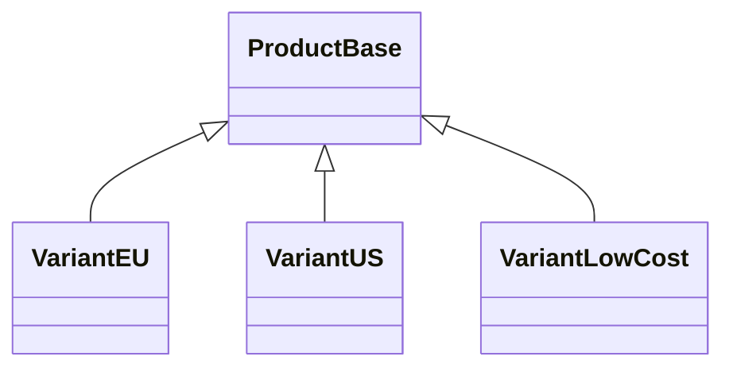
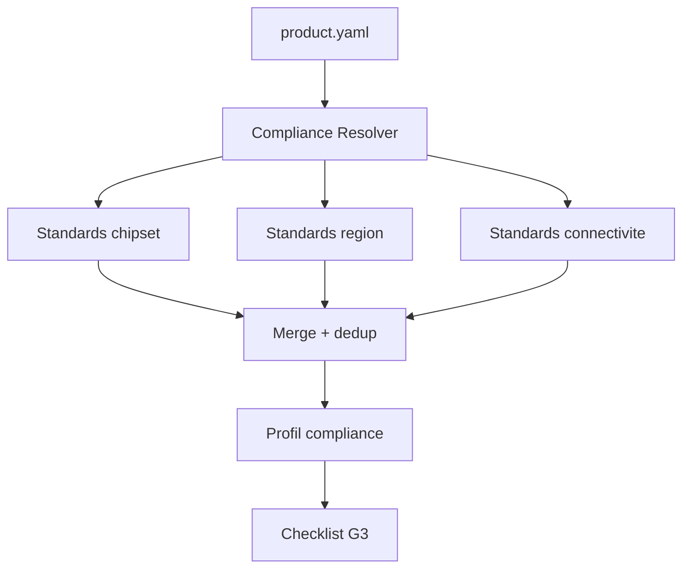

# Gates Produit G0-G4 et Gestion des Variantes

## Gates produit
| Gate | Nom | Entrees requises | Validations | Livrables |
|---|---|---|---|---|
| G0 | Faisabilite | product.yaml, etude chipset | Budget OK, composants dispo, standards identifies | Rapport faisabilite |
| G1 | Design Complete | Schema + PCB + SPICE | ERC 0 erreur, DRC 0 erreur, SI/EMC precheck pass, BOM coutee, review IA | Schema PDF, PCB 3D, BOM |
| G2 | Proto Valide | Proto fonctionnel | Tests firmware pass, mesures conformes, courant veille OK | Evidence pack proto |
| G3 | Certification | Rapports labo | EMC pass, securite pass, RED/CE complet | Dossier technique |
| G4 | Production Ready | BOM finale, Gerbers valides | DFM pass fabricant, yield > 95%, supply chain securisee | Manufacturing package |

## Heritage de variantes

## Resolution automatique des standards

## Application BMU
- Le projet BMU couvre deja une partie G1/G2 (design + proto + validations firmware).
- Le passage robuste vers G3 depend des preuves QA distantes et de la tracabilite documentaire.